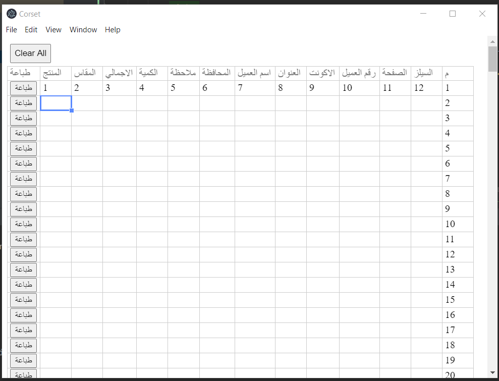
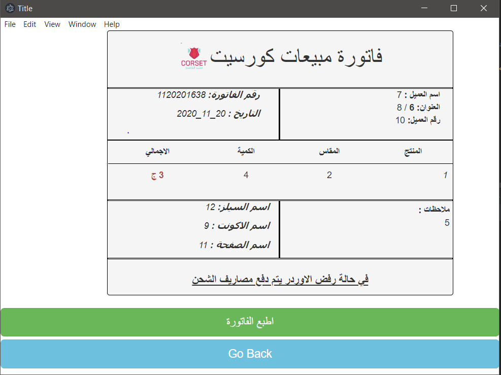
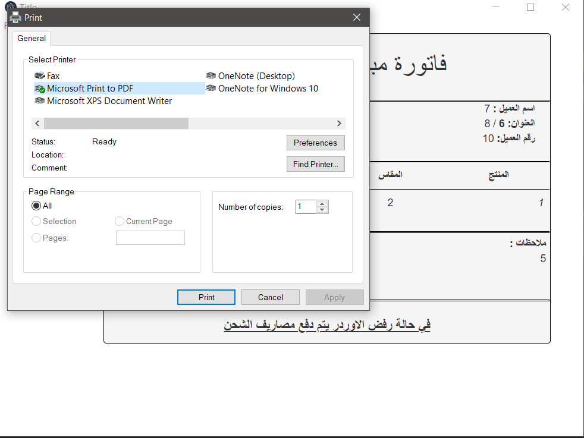
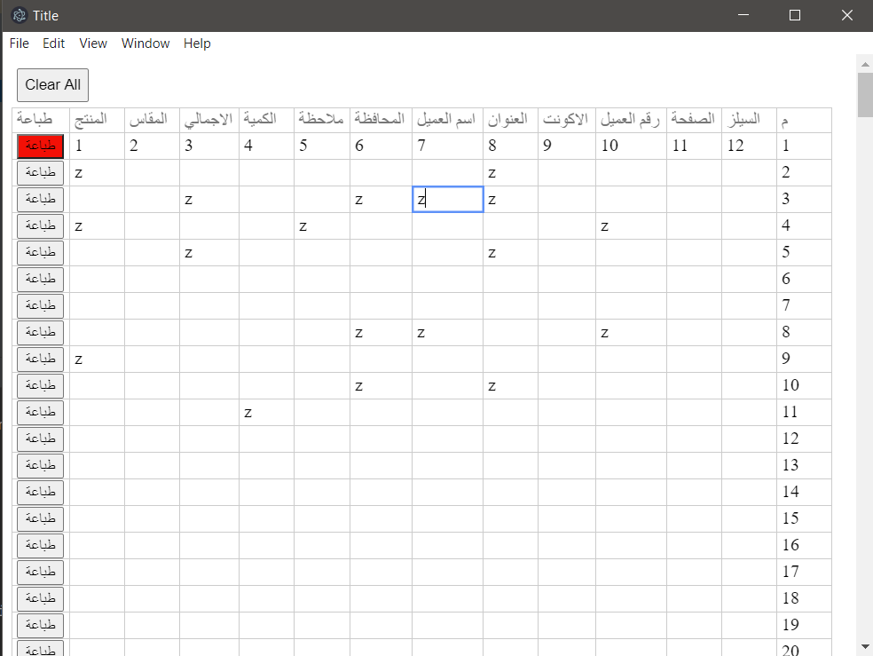
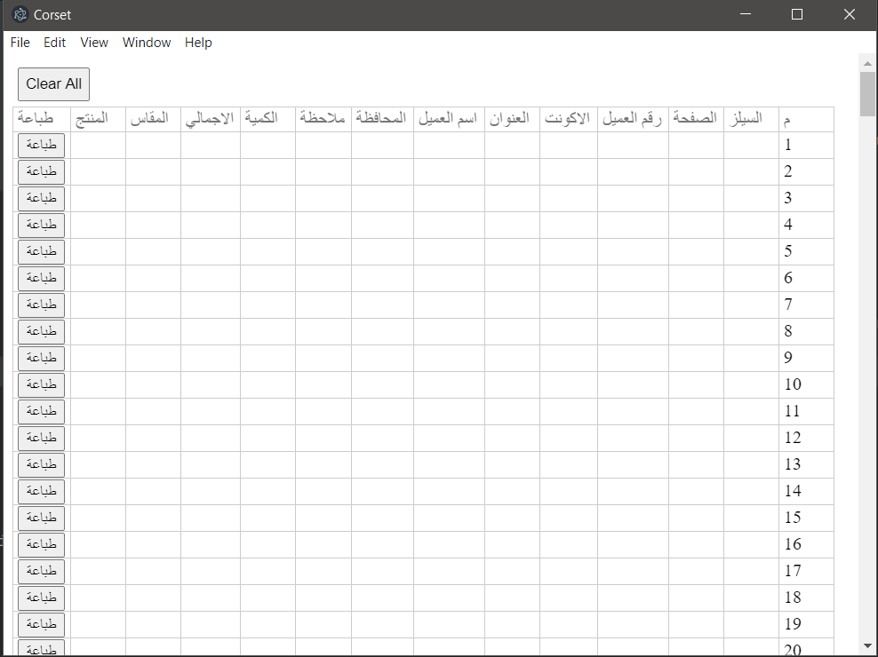

<h1>Recipe Printer</h1>

a desktop application built using electron and node.js

<b>Usage:</b> copying the data from a style sheet and print recipe using the data from any column or using the app as a spreed sheet and get the data saved in a CSV file

<h2>Download Links</h2>
<a href="https://dl.todesktop.com/201113xwuzwr3ux/builds/201114y795h96y1/mac/dmg/x64">MAC</a>
 
<a href="https://dl.todesktop.com/201113xwuzwr3ux/builds/201114y795h96y1/windows/nsis/x64">Widows</a>
 
<a href="https://dl.todesktop.com/201113xwuzwr3ux/builds/201114y795h96y1/linux/appImage/x64">linux</a>

<h2>Application photos</h2>

